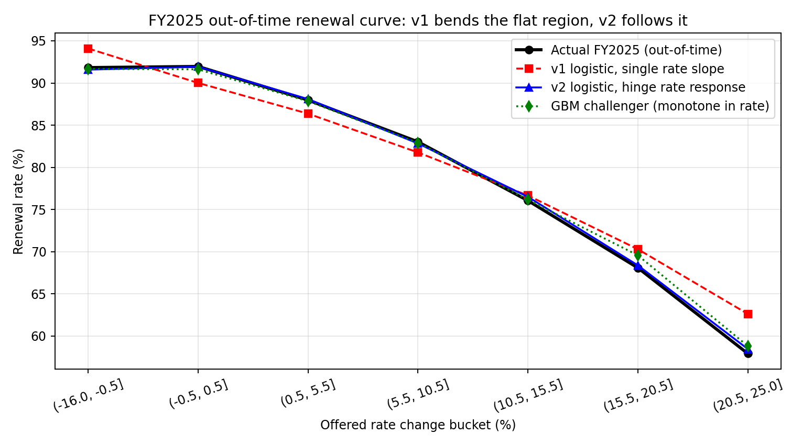
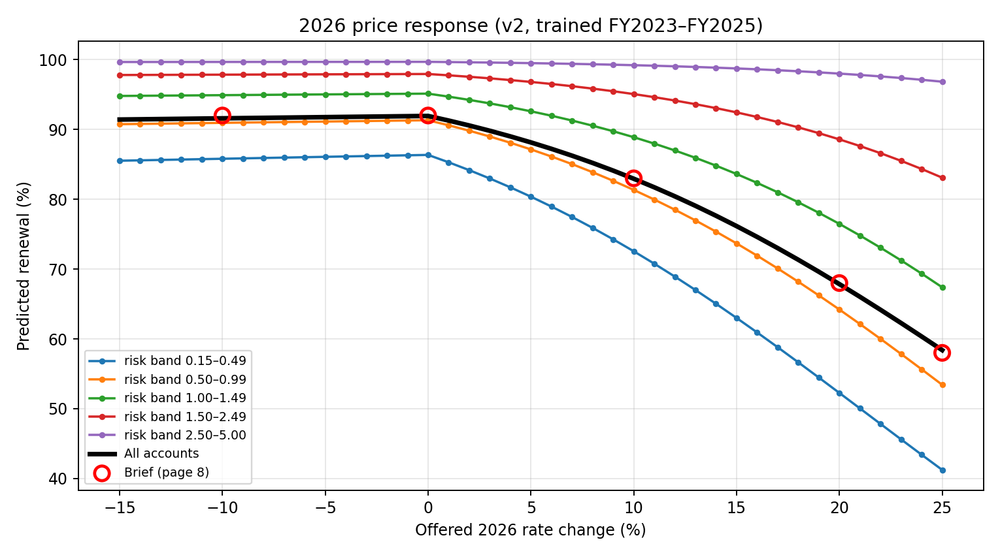
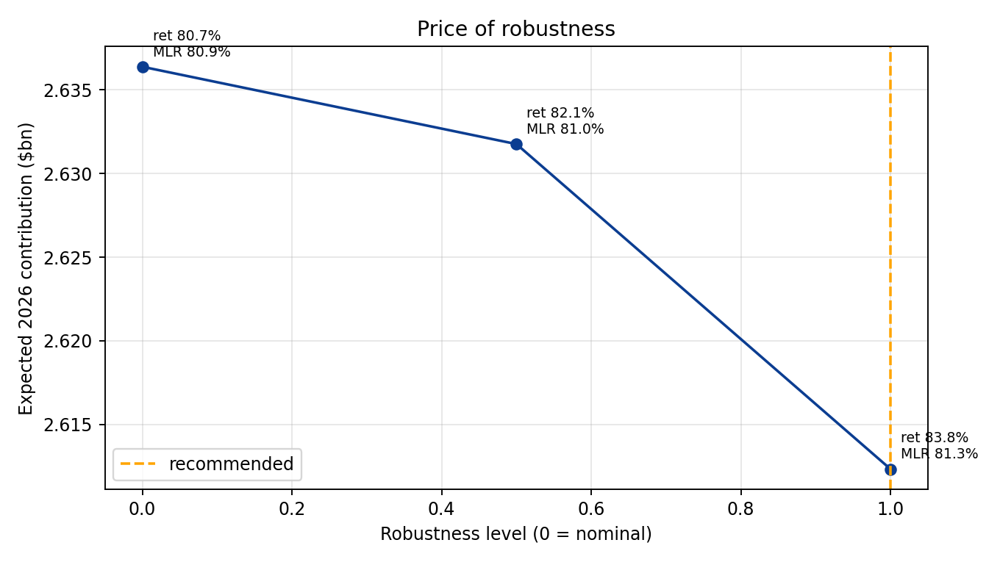
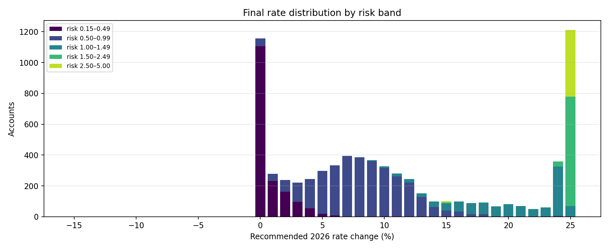
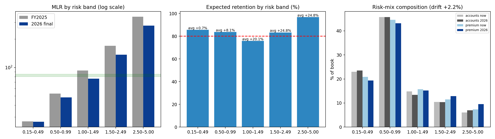
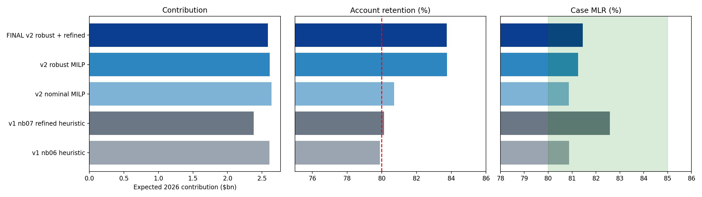
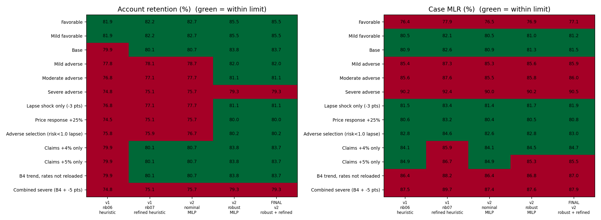
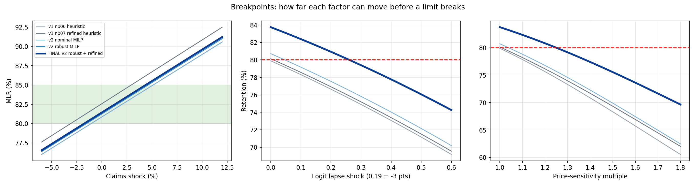
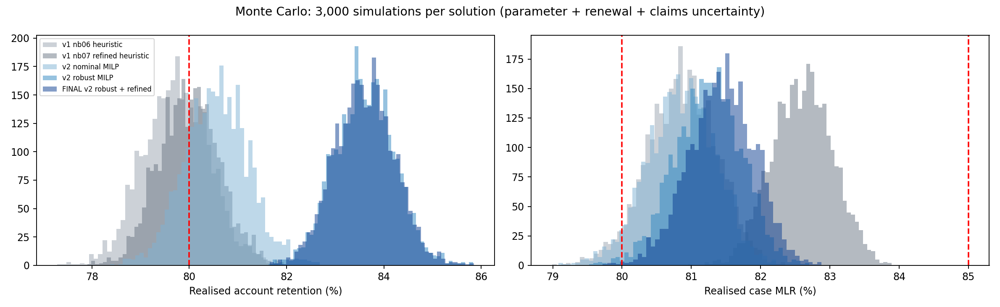

# Oliver Wyman DNA India Decode 2026 · Round 2 · Track A — The renewal quote

**Objective (brief, p.8):** set one rate action for every account that maximises expected underwriting margin, with each rate between −15% and +25%, account retention ≥ 80%, and case MLR back inside the 80–85% pricing corridor. The primary case carries FY2025 paid claims into 2026 with no medical inflation or utilisation trend.

**Final answer:** [`submission_account_rates.csv`](submission_account_rates.csv) gives one rate for each of the 7,300 accounts. Account-level detail is in [`final_rate_recommendations.csv`](final_rate_recommendations.csv) and the rate distribution is in [`rate_distribution.csv`](rate_distribution.csv). All three are produced by `notebooks/13_Final_Robust_Refined.ipynb`.

---

## 1. Headline result

| Metric | FY2025 (as is) | 2026 recommended | Limit |
|---|---|---|---|
| Case MLR | 88.7% | **81.5%** (−7.2 pts) | 80–85% ✓ |
| Account retention | — | **83.7%** | ≥ 80% ✓ |
| Premium-weighted retention | — | **83.0%** | ≥ 80% ✓ |
| Covered-lives retention | — | 82.8% | — |
| Expected premium | $15.00bn | $13.94bn | — |
| Expected paid claims | $13.31bn | $11.35bn | — |
| **Expected underwriting contribution** | $1.70bn | **$2.59bn** (+$0.89bn) | — |
| Premium-weighted average rate | — | +12.0% (no cuts; median +9%) | −15% to +25% ✓ |
| Retained risk-mix drift | — | +2.2% | ±15% ✓ |

The rates also hold under stress. In 3,000 Monte Carlo simulations covering renewal-model parameter uncertainty, the random renew-or-lapse outcome of each account, and claims noise, **all limits hold in 99.8% of cases**. For the v1 solutions the figure was 35–50%.

**Recommendation in one line:** hold healthy accounts flat, re-price loss-making accounts hard, and never cut. Cuts buy no retention, and the high-risk accounts barely leave even at +25%.

---

## 2. Approach

```
EDA (01) ─► Renewal model v2 (10) ─► 2026 grid: 7,300 accounts × 41 rates ─► LP bound + exact MILP (11)
                                                                         └─► Robust MILP + business rules (13, FINAL) ─► Stress tests (12, 13)
```

### 2.1 Why a broad increase does not work
The same rate for every account never meets both limits. Healthy accounts leave, costly accounts stay, and MLR hardly moves.

| Uniform rate | 0% | +5% | +10% | +15% | +20% | +25% |
|---|---|---|---|---|---|---|
| Retention | 91.9% | 88.1% | 82.9% | 76.2% | 67.9% | 58.4% |
| Case MLR | 91.8% | 89.0% | 87.0% | 86.1% | 86.4% | 87.9% |

The rates therefore have to be set account by account. That is an optimisation problem.

### 2.2 Renewal model (notebook 10)
- **Protocol:** develop on FY2023–FY2024, validate out-of-time on FY2025, then refit on **all three years (FY2023–FY2025)** and score 2026. No B4 field is used in the model, and FY2025 claims are not a predictor.
- **Specification:** logistic regression with a **hinge** in the offered rate. Cuts and increases get separate slopes, increases get a curvature term, and there is an increase × risk interaction. Other features are risk score, premium, prior renewal and rate history, industry and region.
- **Why the hinge:** the data are flat at about 92% renewal for any cut or flat quote, then fall to 83% at +10%, 68% at +20% and 58% at +25%. A single linear rate slope, as in our v1 model, bends that flat region. It implies cuts buy retention, and its errors fall exactly where the 80% floor sits.
- **2026 snapshot:** history includes the FY2025 outcome, and risk and premium are the end-of-FY2025 values from B1.

| FY2025 out-of-time test | ROC-AUC | Log loss | Rate-curve error |
|---|---|---|---|
| v1 logistic, single rate slope | 0.740 | 0.388 | 2.09 pts |
| **v2 logistic, hinge (selected)** | **0.743** | **0.385** | **0.27 pts** |
| GBM challenger, monotone in rate | 0.746 | 0.384 | 0.46 pts |

The hinge model reproduces the brief's curve: 91.6% at −10%, 91.9% at 0%, 82.9% at +10%, 67.8% at +20% and 58.4% at +25%.




### 2.3 Optimisation (notebooks 11 and 13)
Each account *i* chooses one rate *r* from the 41 options, with renewal probability *p<sub>ir</sub>*:

- expected premium = *P*<sub>i</sub> (1 + *r*) *p*<sub>ir</sub>
- expected claims = *C*<sub>i</sub> *p*<sub>ir</sub>, where *C*<sub>i</sub> is FY2025 paid claims carried forward with no trend
- objective: maximise Σ (premium − claims)

Constraints are linear: exactly one rate per account; Σ *p* ≥ 0.80 N; and the MLR corridor written as Σ(claims − 0.85 premium) ≤ 0 and Σ(claims − 0.80 premium) ≥ 0.

- **LP relaxation vs MILP.** The problem has 7,300 "pick one" rows plus a handful of portfolio constraints. So at most that handful of accounts can be fractional in the LP, and the LP bound is essentially tight. We solve the LP for the bound, then the **exact MILP** with HiGHS (`highspy`) for the decision. The final MILP (299,300 binary variables) is **proven optimal**: the gap between the MILP objective and the LP bound is 7×10⁻⁸.
- **Robust counterpart.** A plan that only meets the limits in the expected case sits on the boundary and fails under any adverse movement. The same limits must therefore also hold under three adverse scenarios:

| Robust scenario | Calibration | Must hold |
|---|---|---|
| Lapse shock: logit(p) − 0.19 | about −3 pts of retention, hitting healthy and price-sensitive accounts hardest | retention ≥ 80%, MLR ≤ 85% |
| Price response 25% steeper | about 2.3 standard errors on the rate coefficient | retention ≥ 80%, MLR ≤ 85% |
| Claims +4% | largest shock the 5-pt corridor can absorb | MLR ≤ 85% |

- **Business rules** (carried over from our v1 refined model): premium-weighted retention ≥ 80%; retained risk mix within ±15% of today; the top-50 accounts by premium capped at +15%; and a soft penalty on +25% equal to 0.5% of premium. We tested one further v1 rule, forcing accounts with FY2025 MLR > 110% into +15% to +20%, and **dropped it**. It makes the robust problem infeasible and costs about $180m, and it protects accounts that renew at about 97% even at +25%.

| Run (all solved exactly) | Status | Contribution | Retention | MLR |
|---|---|---|---|---|
| Robust + all rules | Infeasible | — | — | — |
| Nominal + all rules | Optimal | $2.405bn | 81.7% | 82.6% |
| **Robust + rules, without the MLR > 110% band (FINAL)** | **Optimal** | **$2.586bn** | **83.7%** | **81.5%** |

- **Price of robustness:** it costs about $26m against the unconstrained optimum, which is under 1% of contribution. Robustness levels above about 1.0 are infeasible, so the chosen level is close to the most protection the ±15/+25 rate limits allow.



---

## 3. The recommendation

### 3.1 Rate distribution

| Rate | Accounts | Share | FY2025 MLR | Expected renewal |
|---|---|---|---|---|
| Cut | 0 | 0% | — | — |
| 0% (hold) | 1,156 | 15.8% | 25% | 85.4% |
| +1 to +5% | 1,279 | 17.5% | 35% | 86.3% |
| +6 to +10% | 1,807 | 24.8% | 50% | 84.0% |
| +11 to +15% | 877 | 12.0% | 78% | 82.0% |
| +16 to +20% | 430 | 5.9% | 79% | 78.5% |
| +21 to +24% | 540 | 7.4% | 99% | 72.3% |
| +25% | 1,211 | 16.6% | 234% | 87.2% |



### 3.2 By risk band and risk-mix composition

| Risk band | Accounts | Avg rate | Retention | FY2025 MLR | 2026 MLR | Account share now → 2026 | Premium share now → 2026 |
|---|---|---|---|---|---|---|---|
| 0.15–0.49 | 1,680 | +0.7% | 85.7% | 27% | 27% | 23.0% → 23.5% | 20.9% → 19.3% |
| 0.50–0.99 | 3,340 | +8.1% | 83.7% | 53% | 48% | 45.8% → 45.7% | 44.6% → 43.2% |
| 1.00–1.49 | 1,080 | +20.1% | 75.8% | 93% | 76% | 14.8% → 13.4% | 15.7% → 15.2% |
| 1.50–2.49 | 760 | +24.8% | 83.3% | 170% | 137% | 10.4% → 10.4% | 11.5% → 12.8% |
| 2.50–5.00 | 440 | +24.8% | 96.9% | 344% | 277% | 6.0% → 7.0% | 7.3% → 9.5% |

The healthy bands keep their share of accounts because they are held near flat, so a broad increase does not drive them out. The two highest bands stay loss-making even at the +25% cap. **Price alone cannot fix them within the limits**, so they need non-price levers such as plan design, care management and provider steering.



### 3.3 Against earlier solutions (all scored on the same v2 renewal curve)

| Solution | Contribution | Retention | MLR | Stress scenarios passed (of 11) | Monte Carlo P(all limits) |
|---|---|---|---|---|---|
| v1 heuristic (nb 06) | $2.607bn | 79.9% ✗ | 80.9% | 2 | 35% |
| v1 refined heuristic (nb 07) | $2.378bn | 80.1% | 82.6% | 3 | 50% |
| v2 nominal MILP | $2.636bn | 80.7% | 80.9% | 5 | 77% |
| v2 robust MILP | $2.612bn | 83.8% | 81.3% | 7 | 99.2% |
| **FINAL: v2 robust + rules** | **$2.586bn** | **83.7%** | **81.5%** | **7** | **99.8%** |



---

## 4. Stress testing (rates held fixed)

Premium **and** claims are re-weighted by the stressed renewal probability. Lapse shocks are applied in logit space, so healthier, price-sensitive accounts leave first.

| Scenario | Retention | MLR | Retention ≥ 80% and MLR ≤ 85%? |
|---|---|---|---|
| Base | 83.7% | 81.5% | ✓ |
| Mild favourable (+2 pts renewal) | 85.5% | 81.2% | ✓ |
| Favourable (+2 pts, claims −5%) | 85.5% | 77.1% | ✓ (below the 80% floor, i.e. simply more profitable) |
| Lapse shock only (−3 pts) | 81.1% | 81.9% | ✓ |
| Price response 25% steeper | 80.0% | 80.8% | ✓ |
| Adverse selection (risk < 1.0 lapse) | 80.2% | 83.0% | ✓ |
| Claims +4% | 83.7% | 84.7% | ✓ |
| Claims +5% | 83.7% | 85.5% | ✗ |
| Mild adverse (−2 pts, claims +5%) | 82.0% | 85.9% | ✗ MLR |
| Moderate adverse (−3 pts, claims +5%) | 81.1% | 86.0% | ✗ MLR |
| Severe adverse (−5 pts, claims +10%) | 79.3% | 90.5% | ✗ |
| *B4 trend (separate, per README)* | 83.7% | 87.0% | ✗, which is a re-pricing trigger |
| *Combined severe (B4 + −5 pts)* | 79.3% | 87.9% | ✗ |

**Breakpoints:** MLR stays ≤ 85% for claims up to **+4.4%**. Retention has **3.7 pts** of headroom and survives a price response up to **1.24×** as steep as history. No rate set can absorb claims shocks of +5% or more inside a 5-point corridor while holding the 80% floor at base, so these are **monitoring triggers for a mid-year re-rate**, not pricing failures.

**B4 trend** (reported separately, as the README requires): if trend arrives on these rates, MLR is 87.0%. Even re-optimised for trend, the corridor cannot be reached within the +25% cap while keeping retention ≥ 80%; the best such plan reaches 86.5% MLR. Trend therefore has to be handled with a separate trend load or re-rate.





### What changed from our v1 stress test
Our v1 stress notebooks had three arithmetic errors:
- premium was held fixed when renewal was shocked;
- claims were not re-weighted by the shocked renewal probability;
- in the B4 scenario, claims were the whole book × trend rather than × renewal probability.

The last error alone produced the reported 104% MLR; corrected, it is 87–89% (`outputs/v2/03_stress_testing/v1_stress_rerun_corrected_arithmetic.csv`). The remaining v1 failures came from the design: retention sat at exactly 80.000%, so any adverse shock failed. The robust constraints fix that.

---

## 5. Key assumptions and limitations
- **Primary case:** FY2025 paid claims per account carried forward with no trend, as the README requires. We did not model regression to the mean in account claims, because only one year of claims is available.
- **Retention** is the expected share of accounts renewing (the mean of *p*). Premium-weighted retention is also constrained.
- **The objective is one-year contribution.** Customer lifetime value is not modelled, and holding healthy accounts flat also protects future years.
- **Uncertainty:** renewal-model parameters are drawn from the fitted covariance, renewals are simulated account by account, and account claims noise uses a Poisson bootstrap of FY2025 episodes.
- **Data not used:** B5, `fraud_audit_sample` and `provider_reference` are Track B inputs. B4 is used only in the separately reported trend scenarios.

---

## 6. Folder structure and how to run

```
TrackA_v2_FINAL/
├── README.md                          ← this file
├── submission_account_rates.csv       ← FINAL submission (7,300 accounts)
├── final_rate_recommendations.csv     ← account-level detail
├── rate_distribution.csv              ← accounts / premium / MLR by rate
├── data/                              ← organiser inputs B1–B4 (+ their README, checksums)
├── notebooks/
│   ├── trackA_v2_utils.py             ← shared model / MILP / stress functions
│   ├── 01_EDA.ipynb
│   ├── 10_Renewal_Model_v2_Hinge.ipynb
│   ├── 11_Robust_Optimisation_v2.ipynb
│   ├── 12_Stress_Test_v2.ipynb
│   └── 13_Final_Robust_Refined.ipynb  ← FINAL
└── outputs/
    ├── EDA/
    └── v2/
        ├── 01_renewal_model/          ← coefficients, OOT tests, 2026 probability grid
        ├── 02_optimisation/           ← LP/MILP runs, frontier, business-rule runs
        ├── 03_stress_testing/         ← v1 bug-fix re-run, breakpoints, Monte Carlo
        └── 04_final_robust_refined/   ← FINAL rates, segments, stress tests, plots
```

**Run:** Python 3.12. Install `pandas numpy scipy scikit-learn matplotlib seaborn highspy jupyter`, then run the notebooks in order: 01 → 10 → 11 → 12 → 13. Notebook 10 takes about 1 minute, 11 about 8 minutes, 12 about 5 minutes and 13 about 5 minutes on one core. All notebooks are saved with their outputs, so they can be read without re-running. Our v1 notebooks (02–09) are not included. Notebooks 12 and 13 show their results in the saved outputs. If they are re-run without the v1 files, those comparison rows are skipped.


